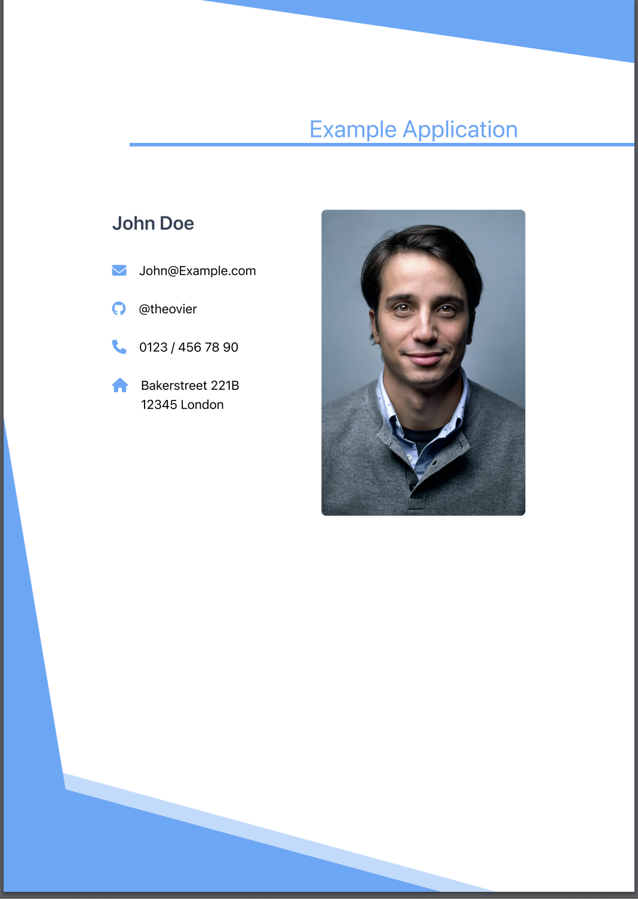
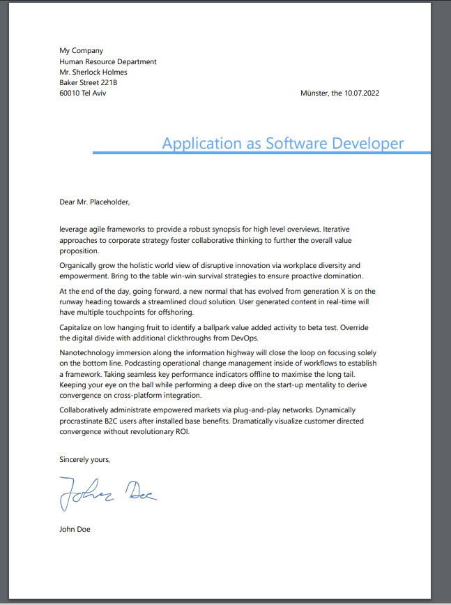
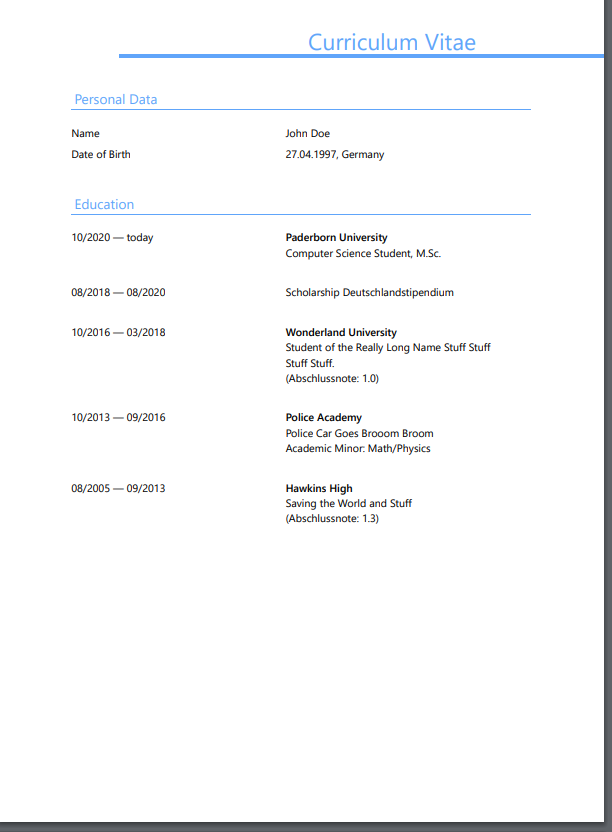
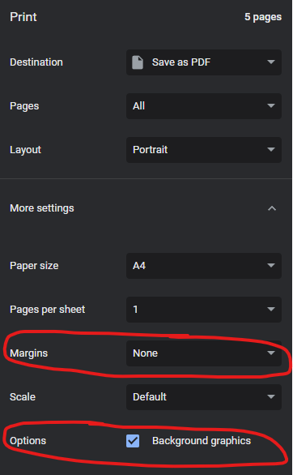

# Printable Multi-Page CV 

Most CVs in Germany contain multiple pages and not only one.
This repository provides a simple multi-page HTML/CSS CV template which can be printed as PDF.
It is not very complex and, therefore, easy to adjust.
⚠ After all, the project is work-in-progress and may be subject to change in the future ⚠. 




## Features

* Simple and fast startup as we use a [Vite](https://vitejs.dev) dev server.
* Easily customizable thanks to [TailwindCSS](https://tailwindcss.com) and [Vue3](https://vuejs.org/).
* Printable as A4 PDF.

## Design

The design is minimalistic yet stylish 🔥.
However, the design does not feel very "modern". 
At the moment we are looking into ways to modernize the design.
An example PDF can be found under `/examples/example.pdf`.



## Usage
The CV is generated by printing a locally hosted website.

### Building

There is no automated command to print the CV yet.
In order to generate and print the CV, the dependencies have to be installed: 

```
npm install
```

Afterwards, the Vite webserver can be started with 

```
npm run dev
```

The website is now running and the CV can be printed.

### Printing

Visit the website and open the printing dialogue (ctrl + P).
In order for the CV to look correct in Google Chrome, you need turn off the margins and select the checkbox to allow background graphics.



After adjusting the printing settings, simply print the website as PDF.

### Adding Content
Adding a new page with new entries can be achieved by a few lines of code: 

```vue
<page>
    <template #header>
        <!-- the headline of the page (big and blue 🐋) -->
        <page-header headline="New Page And Stuff" />
    </template>
    
    <!-- the small blue captions on the page -->
    <section-header text="Experience" />

    <!-- a list of key-value entries -->
    <entry-list>
        <history-entry from="08/2017" to="08/2018" title="This Prints on the Right" />
    </entry-list>
</page>
```
